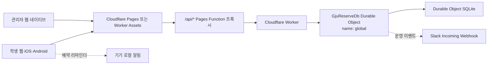

# 01. 서비스 개요와 아키텍처

## 1. 서비스 정의

GJU Photography Reservation은 광주대학교 사진영상미디어학과 내부 구성원이 기자재와 실습 공간을 예약하고, 학과 관리자가 승인·대여·반납·보고서·특강·공지·수요조사를 운영하는 모바일 우선 서비스다.

서비스의 주요 목표는 다음과 같다.

- 학생이 모바일에서 예약 가능 조건을 확인하고 신청한다.
- 관리자가 승인 대기와 당일 운영 항목을 한 화면에서 처리한다.
- 예약 불가 시 다른 날짜·시간·대체 장비를 안내한다.
- 반복 예약은 즐겨찾기 그룹과 최근 예약 재사용으로 단축한다.
- 학기 말에는 학년·학기별 전공선택 과목 수요를 1~5순위로 조사한다.
- 예약, 상태 변경, 사용자 승인, 설정 변경을 감사 로그로 남긴다.
- 웹, iOS, Android가 같은 API와 업무 규칙을 사용한다.

## 2. 사용자와 권한

### 학생

- 가입 신청과 로그인
- 승인 상태 확인
- 승인 완료 후 예약·수요조사·특강 신청
- 본인 예약 조회·수정·취소
- 스튜디오 사용 보고서 제출
- 즐겨찾기 장비 그룹 관리와 최근 구성 재예약
- 프로필·비밀번호·알림·계정 삭제 관리

### 관리자

- 학생 승인·반려·대여금지·경고·비밀번호 초기화
- 예약 승인, 대여, 반납, 완료, 취소, 삭제
- 기자재 등록·수정·일괄 변경·CSV 가져오기
- 스튜디오 보고서 확인
- 비교과 특강과 공지 관리
- 교과 수요조사안 생성·공개·마감·집계와 과목 후보 관리
- 운영 통계·위험 알림 확인
- 차단 일정·출력실·암실·보고서 제출 기한 등 설정
- 세션 회수, 감사 로그 확인, JSON 백업, 보관정책 정리, 학기 종료 정리

현재 권한 모델은 `student`와 `admin` 두 역할만 구분한다. 관리자 내부에서 조교, 교수, 시스템 관리자처럼 세부 권한을 분리하지 않는다.

## 3. 시스템 범위

### 포함 범위

- 계정과 승인
- 기자재, 스튜디오, 암실, 출력실 예약
- 예약 충돌과 운영 제한 검증
- 예약 대안 추천
- 장비 즐겨찾기와 재예약
- 스튜디오 보고서
- 비교과 특강
- 공지
- 교과 수요조사
- 관리자 운영 지표
- Slack 운영 알림
- 기기 로컬 알림
- 데이터 내보내기·보관정책·학기 종료

### 제외 범위

- 학교 공식 수강신청
- 학교 웹의 공식 교과 편성안 작성·승인
- 결제·정산
- 자체 파일 업로드·이미지 저장소
- 서버 푸시 알림(APNs/FCM)
- 복수 학과·복수 테넌트
- 관리자 세부 역할 기반 접근제어
- 재고 회계, 감가상각, 수리비 관리

백엔드에는 연간 개설안 검증·추천 API가 남아 있지만 관리자 화면의 핵심 흐름은 수요조사안과 결과 집계다. 기존 서비스 통합에서는 해당 편성 API를 기본 범위에 포함하지 않는다.

## 4. 현재 기술 구성

| 영역 | 현재 구현 |
| --- | --- |
| 학생·관리자 웹 UI | React 19 + TypeScript, 일부 레거시 JavaScript 어댑터 |
| 디자인 시스템 | Astryx 기반 GJU 공통 토큰과 React 컴포넌트 |
| API 코어 | JavaScript ES Module, Web Crypto·Fetch 기반 |
| 운영 런타임 | Cloudflare Worker |
| 운영 저장소 | Cloudflare Durable Object SQLite |
| 정적 웹 | Cloudflare Pages 또는 Worker Assets |
| 웹 API 프록시 | Cloudflare Pages Function |
| 로컬 개발 | Node.js HTTP 서버 + `data/db.json` |
| iOS·Android | Capacitor 8 네이티브 셸 |
| 운영 알림 | Slack Incoming Webhook |
| 사용자 알림 | Capacitor Local Notifications |

## 5. 운영 아키텍처



브라우저는 기본적으로 같은 출처의 `/api/*`를 호출한다. Pages Function이 운영 Worker로 요청을 전달한다. 네이티브 번들은 같은 출처 프록시를 사용할 수 없으므로 `GJU_NATIVE_API_BASE`로 Worker 주소를 직접 사용한다.

모든 운영 API 요청은 `GJU_RESERVE_DB.getByName("global")`로 같은 Durable Object 인스턴스에 전달된다. 이 구조는 현재 규모에서 예약 충돌을 직렬화하기 쉽지만, 단일 테넌트·단일 쓰기 지점이라는 확장 한계를 가진다.

## 6. 애플리케이션 구조

```text
public/                   배포되는 정적 셸과 런타임 어댑터
src/react/student/        학생 React 화면·컴포넌트
src/react/admin/          관리자 React 화면·컴포넌트
src/react/design-system/  공통 UI 컴포넌트
core.mjs                  전체 API 라우팅과 도메인 조립
core/*.mjs                인증, 예약, 수요조사, 통계 등 도메인 모듈
storage-sql.mjs           운영 SQLite 물리 저장 계층
worker-storage.mjs        레거시 DO 저장소 마이그레이션
worker.mjs                Worker·Durable Object·CORS·보안 헤더
server.mjs                로컬 Node 개발 어댑터
functions/api/            Pages에서 Worker로 전달하는 API 프록시
scripts/                  빌드, 배포, QA, 네이티브 릴리스 자동화
```

업무 규칙은 `core.mjs`와 `core/*.mjs`에 있고, 운영 Worker와 로컬 서버는 같은 코어를 호출한다. 따라서 로컬과 운영의 저장 방식은 다르지만 검증·상태 전이·응답 형태는 동일하다.

## 7. 데이터 흐름

### 로그인

1. 클라이언트가 로그인 ID와 비밀번호를 전송한다.
2. 서버가 이메일, 학번 또는 사용자명으로 사용자를 찾는다.
3. PBKDF2 해시를 검증한다.
4. 14일 유효한 무작위 세션 토큰을 발급한다.
5. 클라이언트가 이후 요청에 Bearer 토큰을 넣는다.

### 예약

1. 학생이 종류별 예약 초안을 작성한다.
2. 서버가 승인 상태, 날짜, 시간, 차단 일정, 정원, 중복 장비를 검증한다.
3. 기자재는 `pending_approval`, 공간은 `auto_confirmed`로 생성한다.
4. 감사 로그와 Slack 전송 로그를 기록한다.
5. 학생과 관리자는 상세 예약과 계산된 `timing` 정보를 조회한다.

### 수요조사

1. 관리자가 현재 학년, 수강 대상 학년, 학기, 기간을 정한다.
2. 전공선택 후보를 예술·다큐멘터리·광고·영상으로 구분해 5~6개 선택한다.
3. 학생 대시보드에서 본인 학년에 맞는 공개 설문을 확인한다.
4. 학생이 1개 이상 5개 이하 과목을 연속된 1~5순위로 저장한다.
5. 관리자는 응답률, 과목별 선택 수, 가중 점수, 순위 분포, 카테고리 합계를 확인한다.

## 8. 비기능 요구사항

### 가용성과 성능

- 예상 규모는 학과 내부 약 100명이다.
- 모든 운영 쓰기는 단일 Durable Object가 순서대로 처리한다.
- 관리자 목록은 기본 100건, 최대 200건 단위 페이지네이션을 지원한다.
- 요청 JSON은 1MiB를 초과할 수 없다.
- Slack 실패는 핵심 트랜잭션 성공 여부와 분리한다.

### 시간과 지역

- 저장 시각은 ISO 8601 UTC 문자열을 사용한다.
- 예약일은 `YYYY-MM-DD` 문자열이다.
- 화면과 운영 날짜 계산은 `Asia/Seoul`을 기준으로 한다.

### 접근성·반응형

- 모바일 390px·430px, 태블릿 768px, 데스크톱 1440px을 자동 QA 대상으로 둔다.
- 아이콘 버튼에 접근성 이름을 제공한다.
- 상태는 색뿐 아니라 텍스트로 표시한다.
- 기본 터치 영역은 44px, compact는 최소 40px을 목표로 한다.

### 개인정보

- 이름, 이메일, 연락처, 학번, 학년·신분, 예약, 보고서, 특강 신청, 세션, 감사 기록을 처리한다.
- 분석 SDK, 광고 식별자, 타사 광고 네트워크를 사용하지 않는다.
- 계정 삭제 시 사용자와 직접 연결된 예약·보고서·특강 신청·경고·세션을 삭제한다.
- 종료 예약 개인정보는 90일 후 익명화하고, 보고서 HTML 스냅샷은 183일 후 삭제한다.

## 9. 현재 릴리스 식별 정보

| 항목 | 값 |
| --- | --- |
| 패키지 내부 버전 | `0.1.0` |
| iOS Marketing Version | `1.5.1` |
| iOS Build | `32` |
| Android Version Name | `1.5.1` |
| Android Version Code | `32` |
| Bundle/Application ID | `kr.ac.gju.photomedia.reserve` |
| iOS 최소 버전 | iOS 15.0 |
| Android Min SDK | 24 |
| Android Target/Compile SDK | 36 |

## 10. 기존 서비스 결합 원칙

- 현재 DB를 기존 서비스 DB와 즉시 합치지 않는다.
- 기존 서비스는 GJU API를 호출하는 어댑터를 먼저 둔다.
- 사용자 ID는 이메일보다 내부 `user.id` 또는 별도 연동 키를 사용한다.
- 기존 서비스 SSO를 적용하려면 토큰 발급 계층을 교체하되 도메인 권한 검사는 유지한다.
- UI만 합칠 경우 `/api/*` 경로, CSP, CORS, 토큰 보관 방식을 먼저 맞춘다.
- 데이터 통합은 기능 검증 후 별도 마이그레이션 단계에서 수행한다.

