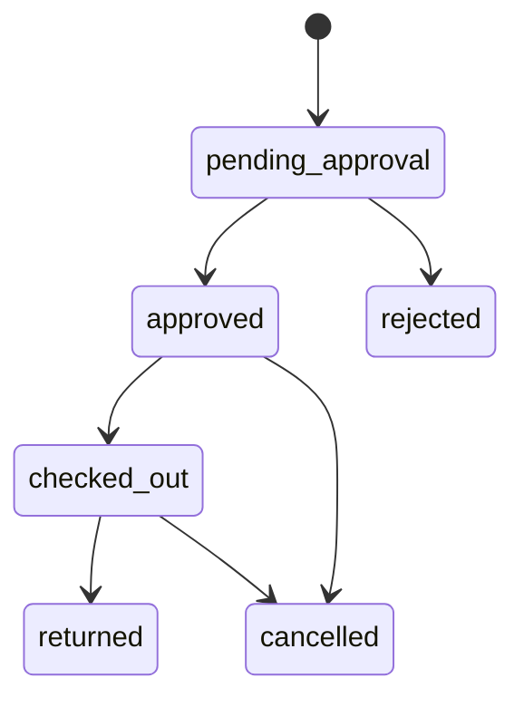

# 02. 전체 기능 및 업무 규칙 명세

## 1. 기능 분류

| 도메인 | 학생 | 관리자 |
| --- | --- | --- |
| 계정 | 가입, 로그인, 프로필·비밀번호, 계정 삭제 | 승인·반려·차단, 경고, 비밀번호 초기화, 사용자 삭제 |
| 예약 | 기자재·스튜디오·암실·출력실 신청, 조회, 수정, 취소 | 조회·검색, 상태 변경, 삭제, 일괄 삭제 |
| 편의 기능 | 즐겨찾기 그룹, 최근 구성 재예약, 대안 추천 | 장비·운영 설정 |
| 보고서 | 스튜디오 사용 보고서 제출 | 미제출·제출·검토 상태 확인, 검토 완료, 삭제 |
| 특강 | 조회, 신청, 취소 | 생성, 수정, 상태 변경, 신청자 확인·CSV, 삭제 |
| 공지 | 목록·검색·상세 | 생성, 공개·임시 상태, 고정, 검색, 삭제 |
| 교과 수요조사 | 대시보드 확인, 카테고리별 선택, 1~5순위 응답 | 과목 관리, 설문안 생성·공개·마감, 결과 집계 |
| 운영 | 기기 로컬 알림 | 대시보드 통계, 세션·로그, Slack, 백업·정리 |

## 2. 계정과 승인

### 2.1 학생 가입

필수 입력은 이름, 신분, 연락처, 이메일, 비밀번호다. 학번과 학년은 선택 입력이지만, 수요조사 대상 판별에는 학년 정보가 필요하다.

검증 규칙:

- 비밀번호는 8자 이상이다.
- 이메일은 기존 사용자와 중복될 수 없다.
- 학번이 입력된 경우 기존 사용자와 중복될 수 없다.
- 가입 직후 상태는 `approval_pending`이다.
- 가입 완료 시 Slack 승인 요청 알림을 시도한다.

### 2.2 로그인

- 로그인 ID는 관리자명, 이메일, 학번, 사용자명 중 하나다.
- 성공 시 14일 유효한 Bearer 토큰을 발급한다.
- 로그인 실패 15분 내 10회 이상이면 5분 동안 차단한다.
- 브라우저의 로그인 유지 선택에 따라 토큰을 `localStorage` 또는 `sessionStorage`에 저장한다.

### 2.3 승인 상태

| 상태 | 의미 | 학생 예약 |
| --- | --- | --- |
| `approval_pending` | 관리자 승인 대기 | 불가 |
| `approved` | 승인 완료 | 가능 |
| `rejected` | 가입 반려 | 불가 |
| `blocked` | 기간 대여금지 | 불가 |

대여금지 기간 선택은 1주, 2주, 1개월, 학기(120일)다. `blockedUntil`이 지난 사용자는 조회 시 실효 상태가 `approved`로 계산되지만 저장된 상태 정리 방식은 통합 시 별도로 검토해야 한다.

### 2.4 경고

- 관리자는 사유와 함께 경고를 누적한다.
- 사용자에는 누적 횟수와 최근 경고 최대 3건을 제공한다.
- 경고 초기화 시 해당 사용자의 경고 레코드도 삭제한다.
- 경고 누적에 따른 자동 차단은 구현되어 있지 않다.

### 2.5 프로필·비밀번호·삭제

- 사용자는 이름, 연락처, 이메일, 학년을 수정할 수 있다.
- 이메일 변경 시 중복을 검증한다.
- 비밀번호 변경은 현재 비밀번호 확인 후 수행하며 해당 사용자의 모든 세션을 회수한다.
- 계정 삭제는 현재 비밀번호와 확인 문구 `계정 삭제`가 필요하다.
- 관리자 계정은 학생 화면과 사용자 삭제 API에서 삭제할 수 없다.

계정 삭제 시 함께 삭제되는 데이터:

- 사용자 레코드
- 사용자 예약
- 사용자 또는 예약에 연결된 보고서
- 특강 신청
- 경고
- 로그인 세션

감사 로그에는 삭제 요약이 남을 수 있다.

## 3. 예약 공통 규칙

### 3.1 예약 종류와 초기 상태

| 종류 | 코드 | 생성 직후 상태 | 승인 방식 |
| --- | --- | --- | --- |
| 기자재 | `equipment` | `pending_approval` | 관리자 승인 |
| 스튜디오 | `studio` | `auto_confirmed` | 자동 확정 |
| 암실 | `darkroom` | `auto_confirmed` | 자동 확정 |
| 출력실 | `print` | `auto_confirmed` | 자동 확정 |

### 3.2 공통 접근제어

- 예약 생성과 추천은 승인 완료 사용자만 가능하다.
- 본인 예약 목록은 로그인 사용자만 볼 수 있다.
- 학생은 본인 예약만 수정·취소할 수 있다.
- 예약 수정 시 현재 승인 상태를 다시 확인한다.
- 예약 취소는 차단 상태여도 본인 예약에 대해 가능하다.
- 종료·취소·반려 상태는 다시 취소할 수 없다.

### 3.3 날짜 규칙

- 예약일은 `YYYY-MM-DD` 형식이다.
- 기자재와 스튜디오는 사용일 전날 23:59까지 신청해야 하며 당일 신청할 수 없다.
- 암실과 출력실은 오늘 날짜 신청이 가능하고 과거 날짜는 불가하다.
- 관리자 차단 일정은 시설, 요일, 적용 시작·종료일, 시간, 대상 공간을 기준으로 적용한다.

### 3.4 수정·취소·이력

- 수정 시 원래 예약 ID를 제외하고 충돌을 다시 검사한다.
- 취소 사유는 `cancelReason`에 저장한다.
- 예약의 생성·수정·취소·상태 변경은 `history` 배열과 감사 로그에 기록한다.
- 예약 생성·수정·취소·상태 변경 시 Slack 전송을 시도한다.

## 4. 기자재 예약

### 4.1 입력

서버 핵심 필드:

- `reservedDate`
- `period`
- `rentalTime`
- `returnTime`
- `equipmentItemIds`
- `phone`

UI 추가 필드:

- `purpose`
- `standRequest`
- `cameraBagConfirmed`
- `equipmentPolicyConfirmed`

### 4.2 운영 기본값

- 대여 시간: 10:15, 12:00, 17:30
- 반납 시간: 10:15, 12:00, 17:10
- 기간: 당일, 1박2일, 2박3일, 주말사용
- 토요일·일요일에는 대여를 시작할 수 없다.
- 2박3일 또는 주말 대여는 금요일 시작만 가능하다.

### 4.3 충돌과 장비 상태

- 선택 장비는 활성·예약 가능 상태여야 한다.
- `가능` 상태만 예약 가능하며 `수리중`, `파손`은 예약할 수 없다.
- 같은 물리 장비 ID의 기간이 기존 운영 중 예약과 겹치면 409를 반환한다.
- 기간 충돌 계산은 당일 0일, 1박2일 1일, 2박3일·주말 2일을 더한 날짜 범위를 사용한다.
- 판타지랩 장비는 항상 문의 전용이며 온라인 예약할 수 없다.

### 4.4 고가 장비·가방

- 기본 고가 장비 분류는 Body와 Lens다.
- 장비명·코드·분류·메모 등에 펠리컨/Pelican 키워드가 있으면 가방 장비로 판정한다.
- 고가 장비를 선택하고 가방 장비를 선택하지 않은 경우 가방 지참 확인이 필요하다.
- 고가 장비 여부, 확인 여부, 가방 동시 예약 여부를 예약 필드에 저장한다.

### 4.5 상태 전이



지원 상태는 `pending_approval`, `approved`, `checked_out`, `returned`, `rejected`, `cancelled`다. 관리자는 정의된 전이 밖으로 변경할 수 없다.

## 5. 스튜디오 예약

### 5.1 입력

- `reservedDate`
- `studioSpace` 또는 `studioSpaces`
- `timeSlots`
- `phone`
- `participants`
- `requiredEquipment`
- `purpose`
- UI 확인용 `studioPolicyConfirmed`
- 보고서 상태 초기값 `required`

### 5.2 기본 공간과 시간

공간:

- Studio A Front
- Studio A Back
- Studio B Front
- Studio B Back

시간은 10:30부터 다음 날 06:00까지 설정된 슬롯을 사용한다. 한 예약은 최대 3개 슬롯이며 설정 순서에서 연속되어야 한다.

### 5.3 충돌

- 같은 날짜에 공간 집합과 시간 슬롯 집합이 모두 겹치면 예약할 수 없다.
- 자정을 넘는 슬롯은 다음 날짜 구간까지 차단 일정을 검사한다.
- 공간별 차단 대상이 지정된 경우 A/B 또는 공간명 매칭으로 적용한다.

### 5.4 보고서

- 스튜디오 예약에는 사용 후 보고서가 필요하다.
- 기본 보고서 제출 기한은 사용 종료 후 48시간이며 관리자가 1~720시간으로 변경할 수 있다.
- 미제출 보고서는 예약일이 오늘 이하이고, 보고서가 없으며, 예약 상태가 취소·관리자 취소·반려가 아닌 경우로 계산한다.
- 보고서 제출 여부는 실제 `reports` 레코드 존재를 기준으로 한다.

## 6. 암실 예약

### 6.1 입력

- `reservedDate`
- `timeSlots`
- `phone`
- `participantCount`
- `processTypes`
- `chemicals`
- `purpose`
- UI 확인용 `darkroomPolicyConfirmed`

### 6.2 기본 운영

- 24시간을 2시간 단위 12개 슬롯으로 제공한다.
- 기본 정원은 한 슬롯당 6명이다.
- 월요일과 화요일 14:00~18:00은 기본 차단이다.
- 자정을 넘는 한 번의 암실 예약은 허용하지 않고 날짜별로 나누어야 한다.

### 6.3 정원 계산

각 선택 슬롯에서 기존 유효 예약의 `participantCount` 합계와 새 신청 인원을 더한다. 설정된 `darkroomCapacity`를 초과하면 409를 반환한다. 참여 인원이 없거나 0이면 최소 1명으로 계산한다.

### 6.4 약품

기본 약품 마스터:

- Kodak D-76
- ILFORD indicator stopbath
- ILFORD Hypam Rapid Fixer
- ILFORD multigrade paper Developer
- Schneider componon-s 50mm f2.8

약품 선택은 예약 필드에 저장된다. 별도 재고 차감은 구현되어 있지 않다.

## 7. 출력실 예약

### 7.1 선행 조건

관리자가 출력 파일 업로드용 Google Drive URL을 등록하지 않으면 학생 UI와 서버 예약 생성을 모두 차단한다.

### 7.2 입력

- `reservedDate`
- `startTime`, `endTime`
- `phone`
- `printType`, `paper`, `size`
- UI 다중 선택 호환 필드 `printTypes`, `papers`, `sizes`
- `count`, `memo`

### 7.3 운영 규칙

- 기본 운영 시간은 10:00~19:00이다.
- 기본 선택 단위는 60분이다.
- 2시간 용량 구간마다 최대 4건을 허용한다.
- 업로드 허용 시작일·종료일이 설정된 경우 그 범위 밖 예약은 불가하다.
- 시작 시간은 종료 시간보다 빨라야 하고 운영 시간 안에 있어야 한다.

출력비 계좌 안내는 설정값으로 화면에 표시하지만 결제 기능은 없다.

## 8. 예약 대안 추천

학생의 초안이 그대로 예약 가능하면 대안을 반환하지 않는다. 예약이 불가능할 때 최대 3개 대안을 반환한다.

추천 순서:

1. 요청일 이후 1~7일 중 처음 가능한 날짜
2. 기자재의 경우 같은 카테고리에서 교체 가능한 장비
3. 종류별 설정값에서 가능한 다른 시간

추천 항목은 전체 예약 객체가 아니라 현재 초안에 적용할 `patch`를 반환한다.

지원 종류:

- `same_equipment_time`
- `alternate_equipment`
- `alternate_time`

추천은 현재 규칙으로 후보를 다시 검증한 결과만 노출한다. 수요 예측이나 개인화 ML은 사용하지 않는다.

## 9. 즐겨찾기와 재예약

### 9.1 즐겨찾기 그룹

- 최대 3개 그룹
- 그룹 이름 최대 12자
- 그룹당 최대 5개 장비
- 하나의 물리 장비는 한 그룹에만 포함
- 활성·예약 가능 장비만 저장 가능
- 학생 대시보드의 바텀시트에서 검색·추가·이동·삭제

### 9.2 최근 예약 재사용

- 최근 수정·생성 순으로 최대 3건을 제공한다.
- 취소, 관리자 취소, 반려 예약은 제외한다.
- 기자재·스튜디오·암실·출력실 구성 필드를 안전한 범위로 복사한다.
- 기존 날짜를 그대로 예약 확정하지 않고 새 예약 초안으로 시작한다.

## 10. 스튜디오 보고서

### 10.1 제출 조건

- 승인 완료 사용자
- 본인의 스튜디오 예약
- 취소·관리자 취소·반려가 아닌 예약
- 예약당 보고서 1건

필수 필드:

- `reservationId`
- `actualTime`
- `participants`
- `cleanupConfirmed`

선택 필드:

- `usedEquipment`
- `resultPhotoUrl`
- `damageFound`
- `damageDescription`
- `notes`

결과 사진은 `http` 또는 `https` 공유 URL만 허용하며 최대 500자다. 서비스는 URL만 저장한다.

### 10.2 상태

- 생성 상태: `submitted`
- 관리자 확인 상태: `reviewed`
- 관리자 보고서 목록에는 저장된 보고서 외에 계산된 `missing` 행도 포함한다.
- `missing:*` 행은 가상 행이므로 DB 보고서 건수와 구분해야 한다.

## 11. 비교과 특강

### 11.1 학생

- 특강 목록과 모집 상태 조회
- 검색과 연도 필터
- 승인 완료 상태에서 모집중 특강 신청
- 정원이 0보다 크면 내부 신청 수와 기존 반영 수의 합계로 정원 검사
- 중복 신청 불가
- 특강 시작 6시간 전부터 신청 취소 불가

### 11.2 관리자

- 제목, 날짜, 시간, 장소, 강사, 소속, 담당 교수, 대상 학년, 정원, 설명, 상태, 비고 관리
- 상태: 모집중, 진행완료, 취소
- 신청자 목록 확인과 CSV 다운로드
- 특강 삭제 시 연결 신청도 삭제

## 12. 공지

- 학생은 공개 상태 공지만 조회한다.
- 제목, 분류, 본문, 고정 여부, 활성 여부, 외부 링크를 관리한다.
- 링크는 `http` 또는 `https`만 허용한다.
- 활성 공지는 `published`, 비활성 공지는 `draft`로 정규화한다.
- 검색·상태·분류·기간·정렬·페이지네이션을 지원한다.

## 13. 교과 수요조사

### 13.1 서비스 책임

이 기능은 학기 말 학생 수요를 설문으로 수집하는 기능이다. 학교 공식 수강신청이나 공식 편성안을 생성하지 않는다.

### 13.2 과목 마스터

주요 속성:

- 과목명·과목코드
- 전필·전선
- 대상 학년
- 허용 학기
- 학생 인정 학점
- 85학점 운영 산정용 학점
- 교수 인정 학점
- 130학점 편성 포함 여부
- 전필 여부
- 필수 개설 주기
- 학기·방학 운영 구분
- 수요조사 사용 여부
- 예술·다큐멘터리·광고·영상 카테고리
- 활성 여부

수요조사 후보는 활성, 수요조사 가능, 전공선택, 해당 학년·학기, 카테고리 지정 조건을 모두 만족해야 한다.

### 13.3 설문안 생성

입력:

- 제목
- 학년도
- 1학기 또는 2학기
- 응답 학생의 현재 학년
- 과목의 수강 대상 학년
- 시작·마감 시각
- 후보 과목
- 상태 `draft` 또는 `open`

규칙:

- 후보는 최대 6개다.
- 공개 설문은 후보가 정확히 5개 또는 6개여야 한다.
- 같은 학년도·학기·현재 학년에 공개 설문이 중복될 수 없다.
- 공개 후 후보·대상 조건은 바꿀 수 없다.
- 공개 후에는 마감일 연장 또는 마감만 가능하다.
- 마감된 설문은 수정할 수 없다.

### 13.4 학생 응답

- 학생 대시보드에서 본인 현재 학년에 맞는 설문을 확인한다.
- 후보는 예술, 다큐멘터리, 광고, 영상 카테고리로 묶는다.
- 1개 이상 5개 이하를 선택한다.
- 순위는 1부터 빈칸 없이 연속되어야 한다.
- 같은 과목을 중복 선택할 수 없다.
- 설문 기간 안에는 기존 응답을 덮어써 수정할 수 있다.
- 이 응답은 수강신청이 아니라 개설 수요 참고 자료임을 화면에 표시한다.

### 13.5 집계

순위별 가중치:

| 순위 | 점수 |
| ---: | ---: |
| 1 | 5 |
| 2 | 4 |
| 3 | 3 |
| 4 | 2 |
| 5 | 1 |

관리자 결과:

- 대상 학생 수
- 응답 학생 수
- 응답률
- 과목별 선택 수
- 과목별 가중 수요 점수
- 1~5순위별 응답 수
- 카테고리별 선택 수와 점수

현재 학생 학년은 `studentYear`, `year`, `grade`, `studentStatus`에서 숫자를 찾는 방식으로 판별한다. 기존 서비스와 통합할 때는 명시적 정수 `grade` 또는 연동 필드를 쓰는 것이 안전하다.

### 13.6 교과 제약 데이터

백엔드 과목 모델에는 다음 제약을 기록할 수 있다.

- 전체 교육과정 편성학점 130
- 1·2학기 운영학점 합계 85
- 전필 필수 개설
- 사진교과교육론·사진교수학습방법 2년 내 개설
- 현장실습은 방학 운영 시 85학점 미포함
- 캡스톤 디자인은 85학점 미포함, 교수 인정 시수 포함
- 현장실습4는 4학년 2학기, 학생 15·운영 0·교수 인정 3학점

이 제약은 과목 데이터와 보조 검증 API에 존재하지만, 현재 수요조사 UI는 공식 편성안을 만들지 않는다.

## 14. 학생 알림

네이티브 앱에서만 기기 로컬 알림을 사용한다.

예약 알림:

- 시작 24시간 전
- 시작 1시간 전
- 기자재 `checked_out` 상태의 반납 1시간 전

스튜디오 보고서 알림:

- 사용 종료 1시간 후
- 보고서 마감 3시간 전

기타 규칙:

- 종료·취소·반려 예약은 시작 알림에서 제외한다.
- 기기당 최대 64개를 시간순으로 예약한다.
- 예약 생성·취소·조회·로그아웃 시 동기화 또는 제거한다.
- 알림 탭 시 내 예약 또는 보고서 화면으로 이동한다.

관리자 로컬 요약 알림은 처리할 건이 있을 때 다음 09:00 또는 15:00에 한 건으로 묶는다. 서버 푸시가 아니므로 앱이 동기화한 이후의 데이터만 반영한다.

## 15. 관리자 대시보드 지표

### 15.1 오늘 처리할 일

| 지표 | 산식 |
| --- | --- |
| 가입 승인 대기 | 학생이면서 `approval_pending`인 현재 사용자 수 |
| 기자재 승인 대기 | 기자재 예약 중 `pending_approval` 수 |
| 승인 완료 | 기자재 예약 중 `approved` 수 |
| 대여 중 | 기자재 예약 중 `checked_out` 수 |
| 반납 완료 | 예약일이 오늘이고 `returned`인 기자재 예약 수 |
| 취소/반려 | 예약일이 오늘이고 `cancelled` 또는 `rejected`인 기자재 예약 수 |
| 오늘 예약 | 예약일이 오늘이고 종료·취소 상태가 아닌 예약 수 |
| 보고서 확인 필요 | 현재 미제출 조건을 만족하는 스튜디오 예약 수 |

### 15.2 운영 기본 지표

- 이번 주 예약: 이번 주 월~일에 해당하고 취소·관리자 취소·반려가 아닌 예약 수
- 활성 기자재: `active !== false`
- 예약 가능 기자재: 활성, 상태 `가능`, 예약 가능, 문의 전용 아님
- 수리 기자재: 활성, 상태 `수리중`
- 기자재 가용률: 예약 가능 기자재 ÷ 활성 기자재 × 100, 반올림
- 누적 취소 예약: 취소·관리자 취소·반려 전체 수
- 보고서 큐: 상태가 없거나 `submitted`인 실제 보고서 수
- 모집중 특강: 상태 `모집중`인 특강 수
- 인기 장비: 취소·관리자 취소·반려를 제외한 예약의 장비명별 사용 횟수 상위 5개

### 15.3 최근 28일 운영 인사이트

혼잡 시간:

- 운영 상태 예약의 시간 슬롯을 종류·시간으로 집계한다.
- 전체 슬롯 표본이 3건 미만이면 데이터 부족으로 표시한다.
- 상위 3개와 전체 슬롯 중 비율을 표시한다.

장비 가동률:

- 최근 28일 동안 각 활성·예약 가능 장비가 예약된 서로 다른 일수 ÷ 28 × 100
- 사용 이력이 있는 상위 5개만 표시한다.

취소율:

- 최근 28일의 취소·관리자 취소·반려 요청 수 ÷ 같은 기간 전체 요청 수 × 100

사전 알림:

- 미반납: `checked_out`이고 계산된 반납 시각이 현재보다 과거
- 장비 부족: 가동률 80% 이상이고 같은 카테고리의 활성·예약 가능 장비가 1개 이하
- 수요 증가: 최근 7일 카테고리 요청 3건 이상이고 직전 3주 주평균의 130% 이상
- 최대 3건을 미반납, 장비 부족, 수요 증가 순으로 표시

통계는 관리자 화면에서만 제공한다.

## 16. 데이터 관리 기능

### 16.1 백업

관리자 JSON 내보내기에는 설정, 약품, 장비, 사용자 공개 필드, 세션 공개 필드, 예약, 보고서, 특강, 공지, 경고, 로그, 교과 데이터가 포함된다. 수요조사의 개별 학생 응답 배열은 내보내기에서 제외된다.

### 16.2 보관정책 정리

- 취소·관리자 취소·반려·반납·완료 예약이 90일을 지나면 사용자 연결과 연락처·신분 등 개인정보를 익명화한다.
- 보고서 HTML 스냅샷은 만료일 또는 제출 후 183일에 삭제한다.
- 만료 세션을 삭제한다.
- 변경이 있으면 감사 로그를 남긴다.

Worker Cron은 3일 간격으로 UTC 18:00에 실행되며, 한국 시간으로는 다음 날 03:00이다.

### 16.3 학기 종료

확인 문구 `학기 종료`가 필요하다.

삭제:

- 전체 예약
- 그 예약에 연결된 보고서
- 전체 세션

유지:

- 사용자
- 기자재
- 설정
- 특강·공지
- 감사·Slack 로그
- 교과 데이터

저장 실패 시 메모리 스냅샷으로 복원한다. 실행 전 JSON 백업이 필수 운영 절차다.

## 17. 기자재 코드와 반납 점검

### 17.1 자동 코드 규칙

모든 물리 장비는 다음 형식의 `codeVersion: 2` 코드를 사용한다.

```text
[분류]-[브랜드]-[제품키]-[3자리 일련번호]
예: CAM-SNY-A7M3-001
```

- 분류 코드는 `CAM`, `LEN`, `LGT`, `AUD`, `DRN`, `ETC` 중 하나다.
- 브랜드는 별칭 사전으로 정규화한다. 예를 들어 소니/Sony는 `SNY`, 캐논/Canon은 `CAN`이다.
- 제품키는 모델 또는 제품명을 영숫자로 정규화하며 최대 16자다.
- 같은 분류·브랜드·제품키 그룹 안에서 다음 일련번호를 배정한다.
- 비활성·삭제 장비의 기존 번호도 사용 이력으로 계산하므로 번호를 재사용하지 않는다.
- 보관 장소와 운영 부서는 코드에 넣지 않고 `source`, `facility` 필드로 관리한다.
- QR 코드와 실물 라벨 출력은 현재 범위에 포함하지 않는다.

### 17.2 신규 등록과 검색

- 관리자 장비 등록 폼은 수동 코드 입력을 받지 않는다.
- 장비명, 분류, 브랜드, 모델, 기능 태그를 입력하면 저장 전 예상 코드를 표시한다.
- 서버가 저장 시점의 전체 장비를 다시 확인해 최종 코드를 확정한다.
- CSV의 기존 `code`, `codePrefix`, `code_prefix` 값은 신규 코드로 쓰지 않고 `legacyCodes`에 보존한다.
- 관리자 검색은 현재 코드, 이전 코드, 장비명, 브랜드, 모델, 제품키, 기능 태그, 관리처를 포함한다.
- 현재 코드 완전 일치, 이전 코드 완전 일치, 제품 정보, 기타 메타데이터 순으로 검색 우선순위를 둔다.
- 학생 화면에는 이전 코드를 노출하지 않는다.

### 17.3 전체 코드 재발급

관리자는 기자재 화면의 `코드 재발급` 탭에서 전체 변경안을 먼저 만든다.

1. 현재 144개 장비의 기존 코드와 신규 코드를 일대일 비교한다.
2. 브랜드 또는 제품 정보 경고가 있는 행은 관리자가 개별 확인한다.
3. 적용 직전에 장비 데이터 지문을 다시 비교해 미리보기 이후 변경이 있으면 `409`로 중단한다.
4. 전체 코드와 정규화 필드를 한 저장 트랜잭션으로 교체한다.
5. 기존 코드는 `legacyCodes`에 중복 없이 보존한다.
6. 적용 실패 시 장비와 마이그레이션 기록을 모두 이전 상태로 복원한다.

현재 재고 검증 기준은 전체 144개, 신규 코드 144개, 신규 코드 중복 0개, 미해결 제품키 0개다.

### 17.4 장비별 반납 점검

`checked_out` 기자재 예약은 일반 상태 변경으로 바로 `returned`가 될 수 없다. 관리자가 `반납 점검`을 열어 예약에 포함된 모든 물리 장비에 다음 결과 중 하나를 기록한다.

| 결과 | 장비 상태 | 온라인 예약 | 메모 |
| --- | --- | --- | --- |
| 정상 `normal` | 가능 | 가능 | 선택 |
| 점검 필요 `needs_inspection` | 수리중 | 불가 | 선택 |
| 수리 필요 `needs_repair` | 수리중 | 불가 | 필수 |

- 모든 예약 장비가 한 번씩 포함되어야 하며 중복·누락 장비 ID는 거부한다.
- 수리 필요 장비에 메모가 없으면 제출할 수 없다.
- 성공하면 예약은 `returned`가 되고 예약 이력과 장비별 검사 기록을 남긴다.
- 예약, 장비, 검사 기록은 부분 성공 없이 한 번에 저장하고 실패 시 모두 복원한다.
- 완료 후 관리자 예약·기자재·대시보드 데이터를 다시 불러온다.
