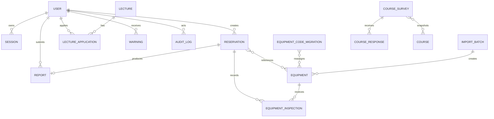

# 04. 데이터베이스 및 데이터 모델 명세

## 1. 저장소 개요

### 운영

- Cloudflare Durable Object 클래스: `GjuReserveDb`
- Durable Object 인스턴스 이름: `global`
- 물리 저장소: Durable Object SQLite
- 저장 구현: `storage-sql.mjs`
- 저장 방식: 조회·인덱스용 컬럼 + 전체 객체를 보존하는 `data` JSON 문자열의 하이브리드 구조
- 저장 트랜잭션: Durable Object `transactionSync`

### 로컬 개발

- 파일: `data/db.json`
- 서버: `server.mjs`
- 요청마다 파일을 읽고 전체 객체를 저장한다.
- 로컬 API 처리는 Promise 체인으로 직렬화해 read-modify-write 충돌을 줄인다.

### 레거시 마이그레이션

과거 Durable Object 저장소 키 `db`에 단일 객체 스냅샷이 있으면, SQLite가 비어 있을 때 한 번 SQL 구조로 복사한다. 레거시 키는 자동 삭제하지 않고 복구용으로 보존한다.

## 2. 논리 구조



SQLite에는 외래 키가 선언되어 있지 않다. 위 관계는 객체 ID와 애플리케이션 코드로 유지된다.

## 3. 물리 SQLite 스키마

모든 컬렉션 테이블의 `data`는 해당 엔터티 전체 JSON 객체다. 나머지 컬럼은 목록 조회·마이그레이션·인덱싱을 위한 투영값이다.

### 3.1 `app_singletons`

| 컬럼 | 형식 | 제약 | 설명 |
| --- | --- | --- | --- |
| `name` | TEXT | PK | 싱글턴 이름 |
| `data` | TEXT | NOT NULL | JSON |
| `updated_at` | TEXT | NOT NULL | 마지막 저장 시각 |

저장되는 이름:

- `meta`
- `settings`
- `darkroomChemicals`
- `coursePlanning`

### 3.2 `users`

| 컬럼 | 형식 | 설명 |
| --- | --- | --- |
| `id` | TEXT PK | 사용자 ID |
| `role` | TEXT | `student`, `admin` |
| `username` | TEXT | 관리자명 등 |
| `email` | TEXT | 이메일 |
| `student_id` | TEXT | 학번 |
| `approval_status` | TEXT | 승인 상태 |
| `created_at` | TEXT | 생성 시각 |
| `updated_at` | TEXT | 수정 시각 |
| `data` | TEXT NOT NULL | 전체 사용자 JSON |

인덱스:

- `idx_users_role_approval(role, approval_status)`
- `idx_users_email(email)`
- `idx_users_student_id(student_id)`

### 3.3 `sessions`

| 컬럼 | 형식 | 설명 |
| --- | --- | --- |
| `id` | TEXT PK | 세션 ID |
| `user_id` | TEXT | 사용자 ID |
| `created_at` | TEXT | 생성 시각 |
| `last_seen_at` | TEXT | 마지막 사용 시각 |
| `expires_at` | TEXT | 만료 시각 |
| `data` | TEXT NOT NULL | 토큰을 포함한 전체 세션 JSON |

인덱스:

- `idx_sessions_user_expires(user_id, expires_at)`
- `idx_sessions_created_at(created_at)`

### 3.4 `equipment`

| 컬럼 | 형식 | 설명 |
| --- | --- | --- |
| `id` | TEXT PK | 물리 장비 ID |
| `source` | TEXT | `department`, `fantasy_lab` |
| `category` | TEXT | Body, Lens 등 |
| `status` | TEXT | 가능, 수리중, 파손 |
| `active` | INTEGER | 활성 1/0 |
| `reservable` | INTEGER | 온라인 예약 가능 1/0 |
| `data` | TEXT NOT NULL | 전체 장비 JSON |

인덱스:

- `idx_equipment_source_category(source, category)`
- `idx_equipment_status_active(status, active)`

### 3.5 `reservations`

| 컬럼 | 형식 | 설명 |
| --- | --- | --- |
| `id` | TEXT PK | 예약 ID |
| `type` | TEXT | equipment, studio, darkroom, print |
| `status` | TEXT | 예약 상태 |
| `user_id` | TEXT | 예약자 ID |
| `reserved_date` | TEXT | 예약일 |
| `created_at` | TEXT | 생성 시각 |
| `updated_at` | TEXT | 수정 시각 |
| `data` | TEXT NOT NULL | 필드·이력 포함 전체 예약 JSON |

인덱스:

- `idx_reservations_type_status_date(type, status, reserved_date)`
- `idx_reservations_user_date(user_id, reserved_date)`
- `idx_reservations_created_at(created_at)`

### 3.6 `reports`

| 컬럼 | 형식 | 설명 |
| --- | --- | --- |
| `id` | TEXT PK | 보고서 ID |
| `type` | TEXT | 현재 `studio` |
| `reservation_id` | TEXT | 연결 예약 ID |
| `user_id` | TEXT | 제출자 ID |
| `submitted_at` | TEXT | 제출 시각 |
| `expires_at` | TEXT | HTML 스냅샷 만료 시각 |
| `data` | TEXT NOT NULL | 전체 보고서 JSON |

인덱스:

- `idx_reports_submitted_at(submitted_at)`
- `idx_reports_reservation_id(reservation_id)`
- `idx_reports_user_id(user_id)`

### 3.7 `lectures`

| 컬럼 | 형식 | 설명 |
| --- | --- | --- |
| `id` | TEXT PK | 특강 ID |
| `status` | TEXT | 모집중, 진행완료, 취소 |
| `lecture_date` | TEXT | 특강일 |
| `created_at` | TEXT | 생성 시각 |
| `updated_at` | TEXT | 수정 시각 |
| `data` | TEXT NOT NULL | 전체 특강 JSON |

인덱스:

- `idx_lectures_status_date(status, lecture_date)`

### 3.8 `lecture_applications`

| 컬럼 | 형식 | 설명 |
| --- | --- | --- |
| `id` | TEXT PK | 신청 ID |
| `lecture_id` | TEXT | 특강 ID |
| `user_id` | TEXT | 사용자 ID |
| `applied_at` | TEXT | 신청 시각 |
| `data` | TEXT NOT NULL | 신청 당시 사용자 스냅샷 포함 JSON |

인덱스:

- `idx_lecture_apps_lecture_user(lecture_id, user_id)`
- `idx_lecture_apps_user(user_id)`

### 3.9 `notices`

| 컬럼 | 형식 | 설명 |
| --- | --- | --- |
| `id` | TEXT PK | 공지 ID |
| `status` | TEXT | published, draft |
| `pinned` | INTEGER | 고정 1/0 |
| `created_at` | TEXT | 생성 시각 |
| `updated_at` | TEXT | 수정 시각 |
| `data` | TEXT NOT NULL | 전체 공지 JSON |

인덱스:

- `idx_notices_status_pinned(status, pinned, created_at)`

### 3.10 `warnings`

| 컬럼 | 형식 | 설명 |
| --- | --- | --- |
| `id` | TEXT PK | 경고 ID |
| `user_id` | TEXT | 대상 사용자 |
| `created_at` | TEXT | 생성 시각 |
| `data` | TEXT NOT NULL | 사유·횟수·처리자 포함 JSON |

인덱스:

- `idx_warnings_user_created(user_id, created_at)`

### 3.11 `audit_logs`

| 컬럼 | 형식 | 설명 |
| --- | --- | --- |
| `id` | TEXT PK | 로그 ID |
| `actor_id` | TEXT | 행위자 ID 또는 빈 값 |
| `action` | TEXT | 이벤트 코드 |
| `target_id` | TEXT | 대상 ID |
| `created_at` | TEXT | 발생 시각 |
| `data` | TEXT NOT NULL | 상세 JSON |

인덱스:

- `idx_audit_logs_created_at(created_at)`
- `idx_audit_logs_action(action)`

### 3.12 `slack_logs`

| 컬럼 | 형식 | 설명 |
| --- | --- | --- |
| `id` | TEXT PK | 전송 로그 ID |
| `event` | TEXT | 이벤트 종류 |
| `status` | TEXT | skipped, sent, failed |
| `created_at` | TEXT | 시도 시각 |
| `data` | TEXT NOT NULL | 메시지·응답 포함 JSON |

인덱스:

- `idx_slack_logs_created_at(created_at)`

### 3.13 `import_batches`

| 컬럼 | 형식 | 설명 |
| --- | --- | --- |
| `id` | TEXT PK | 가져오기 배치 ID |
| `created_at` | TEXT | 생성 시각 |
| `data` | TEXT NOT NULL | 파일명, 결과 건수, 생성 장비 ID |

인덱스:

- `idx_import_batches_created_at(created_at)`

### 3.14 `equipment_code_migrations`

| 컬럼 | 형식 | 설명 |
| --- | --- | --- |
| `id` | TEXT PK | `eqmigration_*` |
| `status` | TEXT | preview/applied/failed |
| `created_at` | TEXT | 변경안 생성 시각 |
| `applied_at` | TEXT | 전체 적용 시각 |
| `data` | TEXT NOT NULL | 지문, 코드 버전, 기존→신규 매핑, 경고·확인 목록 |

인덱스:

- `idx_equipment_code_migrations_status_created(status, created_at)`

### 3.15 `equipment_inspections`

| 컬럼 | 형식 | 설명 |
| --- | --- | --- |
| `id` | TEXT PK | 검사 기록 ID |
| `equipment_id` | TEXT | 물리 장비 ID |
| `reservation_id` | TEXT | 반납 예약 ID |
| `outcome` | TEXT | normal/needs_inspection/needs_repair |
| `checked_at` | TEXT | 관리자 점검 시각 |
| `data` | TEXT NOT NULL | 메모, 처리자, 점검 당시 코드 등 전체 기록 |

인덱스:

- `idx_equipment_inspections_equipment_checked(equipment_id, checked_at)`
- `idx_equipment_inspections_reservation(reservation_id)`

## 4. JSON 엔터티 계약

아래 필드 중 기능에 따라 선택 필드가 존재한다. SQLite `data` JSON이 원본이므로 새 필드 추가 시 물리 컬럼 마이그레이션 없이 저장될 수 있다.

### 4.1 사용자 `User`

| 필드 | 형식 | 설명 |
| --- | --- | --- |
| `id` | string | `user_*`, 관리자 기본 `user_admin` |
| `role` | string | student/admin |
| `username` | string | 관리자 로그인명 등 |
| `name` | string | 이름 |
| `email` | string | 이메일 |
| `phone` | string | 연락처 |
| `studentId` | string | 학번 |
| `grade` | string | 학년 |
| `studentStatus` | string | 재학생 등 |
| `approvalStatus` | string | 승인 상태 |
| `passwordHash` | string | PBKDF2 해시, 외부 응답 제외 |
| `warningCount` | number | 누적 경고 |
| `blockDuration` | string | 차단 기간 코드 |
| `blockedAt`, `blockedUntil` | ISO string | 차단 시작·종료 |
| `preferences.favoriteEquipmentGroups` | array | 즐겨찾기 그룹 |
| `createdAt`, `updatedAt` | ISO string | 생성·수정 |

사용자 이메일·학번 중복은 애플리케이션에서 검사하며 DB UNIQUE 제약은 없다.

### 4.2 세션 `Session`

| 필드 | 형식 | 설명 |
| --- | --- | --- |
| `id` | string | 세션 ID |
| `token` | string | Bearer 토큰 |
| `userId` | string | 사용자 |
| `ip` | string | 접속 IP |
| `userAgent` | string | 브라우저 정보 |
| `device` | string | 파생 기기 표시 |
| `createdAt`, `lastSeenAt`, `expiresAt` | ISO string | 세션 시각 |

`token`은 관리자 세션 목록 공개 응답에서는 제외되지 않는 원본 `data`에만 존재하며, `publicSession` 응답에는 포함되지 않는다. DB 백업과 저장소 접근 권한을 엄격히 제한해야 한다.

### 4.3 장비 `Equipment`

| 필드 | 형식 | 설명 |
| --- | --- | --- |
| `id` | string | 물리 장비 |
| `facility` | string | 기자재실·판타지랩 |
| `source` | string | department/fantasy_lab |
| `category` | string | Body/Lens/Lighting/Audio/Drone/Other |
| `name` | string | 장비명 |
| `brand`, `model` | string | 제조사·모델 |
| `code` | string | 현재 관리 코드 |
| `legacyCodes` | string[] | 관리자 검색용 이전 코드 |
| `brandCode` | string | 정규화 브랜드 코드 |
| `productKey` | string | 정규화 제품키 |
| `functionTags` | string[] | 기능·용도 검색 태그 |
| `codeVersion` | number | 현재 코드 규격 버전, 신규 체계는 2 |
| `codeAssignedAt` | ISO string | 현재 코드 배정 시각 |
| `codeAssignedBy` | string | 코드 배정 관리자 ID 또는 system |
| `status` | string | 가능/수리중/파손 |
| `reservable` | boolean | 온라인 예약 가능 |
| `inquiryOnly` | boolean | 문의 전용 |
| `notes` | string | 비고 |
| `active` | boolean | 활성·비활성 |
| `importBatchId` | string | CSV 배치 |
| `createdAt`, `updatedAt` | ISO string | 생성·수정 |

초기 데이터는 물리 개체 단위로 144건을 생성한다.

코드는 `[분류]-[브랜드]-[제품키]-[3자리 일련번호]` 형식이며 예약 관계는 코드가 아닌 `equipment.id`를 사용한다. 따라서 코드 재발급이 기존 예약의 장비 연결을 변경하지 않는다.

### 4.4 예약 `Reservation`

공통:

| 필드 | 형식 | 설명 |
| --- | --- | --- |
| `id` | string | `res_*` |
| `type` | string | 예약 종류 |
| `userId` | string | 예약자 |
| `status` | string | 상태 |
| `fields` | object | 종류별 입력 |
| `history` | array | 예약 이력 |
| `cancelReason` | string | 취소 사유 |
| `adminNote` | string | 관리자 메모 |
| `retentionAnonymizedAt` | ISO string | 보관정책 익명화 시각 |
| `createdAt`, `updatedAt` | ISO string | 생성·수정 |

계산 응답 필드:

- `user`: 공개 사용자 정보
- `equipmentItems`: 장비 ID를 해석한 목록
- `timing.startAt`
- `timing.endAt`
- 스튜디오 `timing.reportDeadlineAt`

종류별 `fields`:

| 종류 | 핵심 필드 |
| --- | --- |
| equipment | reservedDate, period, rentalTime, returnTime, equipmentItemIds, phone, purpose, standRequest, cameraBag* |
| studio | reservedDate, studioSpace/studioSpaces, timeSlots, participants, requiredEquipment, purpose, phone, reportStatus |
| darkroom | reservedDate, timeSlots, processTypes, participantCount, chemicals, purpose, phone |
| print | reservedDate, startTime, endTime, printType(s), paper(s), size(s), count, memo, phone |

### 4.5 보고서 `Report`

| 필드 | 형식 | 설명 |
| --- | --- | --- |
| `id` | string | 보고서 ID |
| `type` | string | studio |
| `status` | string | submitted/reviewed |
| `reservationId` | string | 예약 |
| `userId` | string | 제출자 |
| `fields` | object | 실제 시간, 인원, 장비, 링크, 정리, 파손, 비고 |
| `htmlSnapshot` | string | 만료 가능한 HTML 요약 |
| `submittedAt`, `expiresAt` | ISO string | 제출·만료 |
| `reviewedAt`, `reviewedBy` | ISO/string | 검토 |
| `htmlDeletedAt` | ISO string | HTML 삭제 |

관리자 목록의 `isMissing=true` 행은 DB 엔터티가 아니며 `id`가 `missing:<reservationId>` 형태다.

### 4.6 특강·신청

`Lecture`:

- id, title, lectureDate, time, location
- instructorName, instructorAffiliation, professor
- targetGrades, capacity, baseApplicationCount
- description, status, notes
- createdAt, updatedAt

`LectureApplication`:

- id, lectureId, userId
- userName, studentId, studentStatus, phone, email
- appliedAt

신청에는 신청 당시 사용자 정보를 스냅샷으로 함께 저장한다.

### 4.7 공지 `Notice`

- id
- title
- category
- body
- pinned
- active
- status
- link
- createdAt, updatedAt

### 4.8 경고·감사·Slack·가져오기

`Warning`:

- id, userId, reason, count, actorId, createdAt

`AuditLog`:

- id, actorId, action, targetId, detail, createdAt

`SlackLog`:

- id, event, status, message, response, createdAt

`ImportBatch`:

- id, filename, uploadedBy, status
- totalRows, readyRows, warningRows, errorRows
- createdItemIds
- createdAt, appliedAt

## 5. 싱글턴 데이터

### 5.1 `meta`

```json
{
  "version": 1,
  "createdAt": "ISO timestamp",
  "storageMigration": {
    "from": "legacy-durable-object-db",
    "legacyKey": "db",
    "migratedAt": "ISO timestamp",
    "preservedLegacyDb": true,
    "collectionCounts": {}
  }
}
```

### 5.2 `settings`

설정 그룹:

- 서비스명·학과명·학생/관리자 URL·Slack 채널
- 예약 가능 기간
- 기자재 카테고리·대여/반납 시각·기간
- 스튜디오 공간·슬롯·최대 슬롯·보고서 기한
- 암실 정원·슬롯·기본 차단 규칙
- 출력실 운영시간·단위·용량·유형·용지·크기·계좌·Drive URL·기간
- 고가 장비·가방 판정
- 방학 모드·기간
- 시설별 차단 일정
- 공지 정렬

관리자 API로 수정 가능한 것은 이 중 일부다. 나머지는 코드 기본값으로 보완된다.

### 5.3 `darkroomChemicals`

배열 항목:

- id
- process
- name
- options

### 5.4 `coursePlanning`

```text
coursePlanning
├── curriculumVersions[]
├── courses[]
├── annualPlans[]
├── surveys[]
├── responses[]
└── offeringHistory[]
```

`Course`:

- id, courseCode, name, majorType
- targetYears[], allowedTerms[]
- studentCredit, operatingCredit, facultyRecognizedCredit
- countsTowardCurriculum130
- isMajorRequired, requiredFrequencyYears
- deliveryPeriod
- isSurveyEligible, demandCategory, active

`CourseSurvey`:

- id, title, academicYear, term
- eligibleCurrentYears[], targetStudentYears[]
- opensAt, closesAt, status
- catalogSnapshot[]
- createdAt, updatedAt

`CourseResponse`:

- id, surveyId, studentId
- rankings[{ courseId, rank }]
- submittedAt

설문은 당시 과목명을 유지하기 위해 과목 ID 목록만 저장하지 않고 후보 과목 스냅샷을 저장한다.

## 6. ID·시간·상태 규칙

### ID

대부분 `<prefix>_<무작위 14자>` 형식이다.

예:

- `user_*`
- `session_*`
- `eq_*`
- `res_*`
- `report_*`
- `lecture_*`
- `lecture_app_*`
- `notice_*`
- `warning_*`
- `audit_*`
- `slack_*`
- `import_*`
- `course_survey_*`
- `course_response_*`

기존 서비스의 정수 PK로 바꾸지 말고 문자열 외부 키를 유지하거나 연동 매핑 테이블을 둔다.

### 시간

- `createdAt` 등: UTC ISO 문자열
- `reservedDate`, `lectureDate`: `YYYY-MM-DD`
- 시간 필드: `HH:MM` 또는 `HH:MM-HH:MM` 라벨
- 통계·마감·예약 제한: Asia/Seoul

### 로그 보관 상한

- 감사 로그 최대 1,000건
- Slack 로그 최대 500건
- 관리자 로그 API는 최신 400건 반환

## 7. 삭제와 관계 정리

| 동작 | 관계 정리 |
| --- | --- |
| 학생 계정 삭제 | 예약, 보고서, 특강 신청, 경고, 세션 삭제 |
| 예약 삭제 | 연결 보고서 삭제 |
| 보고서 삭제 | 예약의 `reportStatus`를 required로 되돌림 |
| 특강 삭제 | 연결 신청 삭제 |
| 경고 초기화 | 사용자 경고 전체 삭제 |
| 학기 종료 | 예약, 연결 보고서, 전체 세션 삭제 |
| 보관정책 | 종료 예약 개인정보 익명화, 보고서 HTML·만료 세션 삭제 |

DB 외래 키나 `ON DELETE CASCADE`가 없으므로 모든 삭제는 API 도메인 함수를 통해 수행해야 한다. DB 직접 삭제는 고아 데이터를 만들 수 있다.

## 8. 기존 서비스 DB에 통합할 때 권장 스키마

직접 DB 통합이 최종적으로 필요하다면 JSON 하이브리드 구조를 그대로 복제하기보다 기존 서비스의 표준에 맞춰 정규화한다.

권장 핵심 테이블:

```text
gju_users
gju_user_identities
gju_sessions
gju_equipment
gju_reservations
gju_reservation_equipment
gju_reservation_history
gju_studio_reports
gju_lectures
gju_lecture_applications
gju_notices
gju_warnings
gju_audit_logs
gju_slack_logs
gju_import_batches
gju_settings
gju_blocked_schedules
gju_courses
gju_course_demand_surveys
gju_course_demand_candidates
gju_course_demand_responses
gju_course_demand_rankings
```

필수 제약 권장:

- 사용자 이메일과 유효 학번 UNIQUE
- `(lecture_id, user_id)` UNIQUE
- `(survey_id, student_id)` UNIQUE
- `(response_id, rank)` UNIQUE
- `(response_id, course_id)` UNIQUE
- 예약·보고서·신청 관계 FK
- 상태 CHECK 제약
- 모든 변경 엔터티에 `created_at`, `updated_at`
- 소프트 삭제가 필요한 마스터에 `deleted_at`

### 연동 사용자 매핑

```text
gju_user_identities
- id
- existing_service_user_id
- gju_user_id
- student_id_snapshot
- linked_at
- unlinked_at
```

이메일이나 학번만으로 실시간 조인하지 않는다. 이메일 변경, 복학생 학번 정책, 중복 데이터에 대비해 명시적 연결 ID를 사용한다.

## 9. 데이터 마이그레이션 절차

1. 관리자 내보내기 API로 읽기 전용 스냅샷을 만든다.
2. 원본 개수와 테이블별 체크섬을 기록한다.
3. 사용자·장비·설정·과목 마스터를 먼저 이관한다.
4. 예약과 연결 장비를 이관한다.
5. 보고서·특강 신청·경고·로그를 이관한다.
6. 수요조사와 응답은 운영 내보내기에서 응답이 제외되므로 저장소 직접 추출 또는 전용 관리자 내보내기 API를 먼저 구현한다.
7. 관계 누락, 중복 이메일·학번, 존재하지 않는 장비·예약 ID를 검증한다.
8. 읽기 비교 기간을 거친 뒤 쓰기 전환한다.
9. 원본 Durable Object는 롤백 기간 동안 보존한다.

## 10. 데이터 통합 위험

- 전체 객체가 `data` JSON에 있으므로 투영 컬럼만 복사하면 필드가 유실된다.
- 수요조사 응답은 현재 관리자 백업에서 의도적으로 제외된다.
- 외래 키가 없어 이미 존재하는 고아 관계를 마이그레이션 전에 검사해야 한다.
- 세션 토큰은 민감정보이므로 새 서비스로 이전하지 말고 모두 만료시키는 것이 안전하다.
- 감사 로그 상한 때문에 장기 감사 증적 저장소로 사용할 수 없다.
- 예약 통계는 `fields.reservedDate`와 파생 `timing`에 의존하므로 날짜 변환 규칙을 유지해야 한다.
- `missing` 보고서는 가상 데이터이므로 보고서 테이블에 적재하지 않는다.
